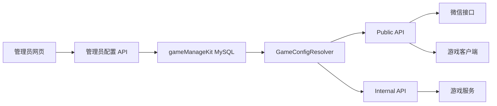

# gameManageKit 管理员全量配置设计

## 1. 文档目标

本设计将 gameManageKit 调整为管理员配置的唯一入口：

- 游戏项目由管理员创建和维护。
- 每个游戏的全部区服由管理员配置。
- 微信 AppID、AppSecret、超时、熔断和限流参数由管理员配置。
- Service 身份、机器 Admin 身份及其 Secret 由管理员配置和轮换。
- Public `/areas`、登录、内部服务鉴权均读取管理员保存的配置。
- 运行时不再依赖 `config/games.json`、`areas.*.json` 或每游戏 Secret 环境变量。
- 管理员保存配置后自动生效，不以人工重启作为配置发布机制。

这里的“全部由管理员配置”指全部业务配置。系统仍必须保留最小的部署信任根，不能把
用于启动系统的所有凭据再存回同一个系统。

## 2. 范围与信任边界

### 2.1 进入管理员平台的配置

- 游戏名称、说明、状态和客户端可见性。
- 游戏区服目录及 `isOps`。
- 区服名称、标签、状态、开服时间、连接地址、开放开关和排序。
- 微信 AppID、AppSecret、接口地址、超时和熔断参数。
- 会话 TTL、登录限流和管理接口限流。
- Service 身份及其游戏授权范围。
- 机器 Admin 身份及其游戏授权范围。
- Service Secret 和机器 Admin Secret 的生成、轮换、撤销及过期时间。

### 2.2 不进入管理员平台的系统信任根

以下配置在管理员网页可用之前就必须存在，因此不能循环存储在 gameManageKit 自己的
MySQL 中：

- `GAME_MANAGE_KIT_MYSQL_URL`。
- TLS 私钥或反向代理证书。
- 首个管理员的引导创建流程。

由于微信 AppSecret 按本设计以明文存入 MySQL，数据库访问凭据、数据库 TLS、磁盘加密
和备份加密属于部署信任边界，不能通过管理员网页关闭。

## 3. 核心原则

1. MySQL 是游戏、区服和接入元数据的唯一真源。
2. 既有 Secret 永不通过 GET API 或管理员网页回显。
3. 微信 AppSecret 在 MySQL 中明文保存；Service Secret 只保存不可逆摘要。
4. Secret 修改与普通游戏编辑使用不同权限。
5. Secret 变更要求最近重新认证。
6. 所有配置写入使用 revision 乐观锁和事务内实时权限复核。
7. Secret 明文不得进入日志、审计、指标、URL、浏览器存储或错误响应。
8. 管理员保存后通过 revision 自动热更新，多实例不依赖人工重启。
9. 游戏、环境和机器身份之间不得共享 Secret。
10. 空游戏、空区服和配置未完成都是合法的管理状态，不能阻止管理员平台启动。

## 4. 总体架构



管理员 API 负责验证、摘要、事务、版本和审计。Public 与 Internal API 只通过
运行时 Resolver 获取已经生效的配置，不直接读取管理员请求内容。

## 5. 配置分类

| 配置类型 | 保存方式 | 管理员网页行为 |
|---|---|---|
| 游戏名称、端点、TTL、限流 | MySQL 明文 | 可查看、可编辑 |
| 微信 AppID | MySQL 明文 | 可查看、可编辑 |
| 微信 AppSecret | MySQL 明文 | 只能替换，永不回显 |
| Service Secret | 服务端生成，MySQL 仅保存摘要 | 创建或轮换时显示一次 |
| 机器 Admin Secret | 服务端生成，MySQL 仅保存摘要 | 创建或轮换时显示一次 |
| MySQL 凭据、TLS 私钥 | 部署信任根 | 不进入网页 |

微信 AppSecret 必须可恢复，因为 gameManageKit 调用微信时需要使用明文。本项目明确
选择直接存储明文，不在应用层加密。该选择降低了实现和运维复杂度，但意味着一旦 MySQL
账号、数据库快照或备份泄露，AppSecret 也会直接泄露。Service Secret 和机器 Admin
Secret 只用于校验请求，不需要恢复原文。

## 6. 数据模型

### 6.1 游戏项目

继续使用 `games`：

```text
games
├── game_id
├── name
├── description
├── status
├── configuration_state
├── client_visible
├── sort_order
├── revision
├── created_at
└── updated_at
```

配置状态：

- `draft`：允许管理员配置，但不进入 Public API。
- `configured`：必需接入配置已经完整。

运行状态：

- `enabled`：允许正常对外服务。
- `maintenance`：整体维护，不允许玩家进入。
- `disabled`：永久停用，不能恢复。

### 6.2 游戏目录设置

扩展 `game_directory_settings`：

```text
game_directory_settings
├── game_id
├── is_ops
├── revision
├── created_at
└── updated_at
```

任何区服新增、编辑或目录设置修改都在同一事务中递增目录 `revision`。该版本用于：

- 判断整个目录是否变化。
- 多实例缓存失效。
- Public 列表 hash 或 ETag。
- 管理员页面识别迟到响应。

创建游戏项目时必须在同一事务中创建空目录设置。没有区服是合法状态。

### 6.3 游戏区服

继续使用 `game_servers`：

```text
game_servers
├── game_id
├── server_id
├── name
├── tag
├── status
├── open_time
├── game_http_url
├── game_ws_url
├── is_open
├── sort_order
├── revision
├── created_at
└── updated_at
```

使用 `(game_id, server_id)` 作为主键。`server_id` 创建后不可修改，不同游戏可以使用
相同的 `server_id`。

字段语义：

- `is_open=false`：已经配置，但未进入开放流程。
- `is_open=true`：管理员允许该区服参与开放判断。
- `status=smooth|busy`：运行状态允许进入。
- `status=maintenance`：临时不可进入。
- `open_time`：计划开服时间。
- `tag`：客户端展示标签，不参与鉴权。
- `sort_order`：管理员和客户端展示顺序。

第一阶段不提供物理删除。永久退役先使用 `is_open=false`，避免破坏历史角色和会话数据。

### 6.4 游戏接入配置

新增 `game_integrations`：

```text
game_integrations
├── game_id
├── wechat_app_id
├── wechat_app_secret
├── wechat_secret_version
├── wechat_secret_updated_by
├── wechat_secret_updated_at
├── wechat_endpoint
├── wechat_timeout_ms
├── wechat_breaker_threshold
├── wechat_breaker_open_ms
├── session_ttl_seconds
├── login_rate_capacity
├── login_rate_refill_per_second
├── admin_rate_capacity
├── admin_rate_refill_per_second
├── revision
├── created_at
└── updated_at
```

创建游戏草稿时同时创建默认接入配置。缺少 AppID 或 AppSecret 时，游戏保持 `draft`。

`wechat_app_secret` 使用可空文本字段明文存储。替换时直接覆盖旧值，不保留旧
AppSecret；`wechat_secret_version` 在同一事务中递增。审计只记录版本、操作者和时间，
不得记录新旧 AppSecret。

### 6.5 机器身份

新增：

```text
machine_identities
├── identity_id
├── identity_type
├── display_name
├── status
├── revision
├── created_at
└── updated_at

machine_identity_games
├── identity_id
└── game_id

machine_secret_versions
├── identity_id
├── version
├── secret_digest
├── state
├── expires_at
├── created_by
├── created_at
├── activated_at
├── last_used_at
└── revoked_at
```

`identity_type` 只允许：

- `service`
- `machine_admin`

`state` 只允许：

- `current`
- `previous`
- `revoked`

每个身份最多同时存在一个 `current` 和一个未过期的 `previous` 版本。`previous`
必须有明确失效时间。

### 6.6 管理员权限与提升会话

扩展 `admin_operators`：

```text
can_manage_games
can_manage_integrations
can_rotate_secrets
can_manage_machine_identities
```

扩展 `admin_sessions`：

```text
elevated_until
```

普通游戏和区服管理不要求提升会话。下列操作要求最近重新认证：

- 写入或替换微信 AppSecret。
- 创建或轮换 Service Secret。
- 创建或轮换机器 Admin Secret。
- 撤销当前或 previous Secret。
- 修改机器身份的游戏授权范围。

## 7. Secret 存储与保护

### 7.1 微信 AppSecret

微信 AppSecret 由管理员输入，后端校验非空和长度后直接写入
`game_integrations.wechat_app_secret`。为降低明文存储的暴露面：

- 仅运行 gameManageKit 的数据库账号可以读取该字段。
- 管理后台使用的数据库账号不得授予导出、复制或管理权限。
- 应用与 MySQL 之间强制使用 TLS。
- MySQL 数据盘、快照和备份必须加密，并限制下载权限。
- 禁止在 SQL 日志、慢查询日志、ORM 参数日志和错误追踪中记录该字段。
- 不提供 AppSecret 查询、查看、复制、导出或历史版本功能。
- 替换时在单个事务内覆盖旧值、递增版本并写入不含 Secret 的审计记录。
- 删除游戏时按数据保留策略同时删除 AppSecret，不进入软删除快照。

管理员保存成功只代表已经写入 MySQL，不代表微信侧凭据验证成功。运行时首次调用微信
失败时记录不含 Secret 的错误，并在管理页面显示连接验证失败状态。

### 7.2 Service Secret

Service Secret 和机器 Admin Secret 必须由服务端生成，不允许管理员手工输入低熵值：

```text
crypto.randomBytes(32) → Base64URL
```

明文只在创建或轮换成功响应中返回一次。数据库只保存 SHA-256 摘要，并使用常量时间
比较验证请求。

一次性 Secret 丢失后只能重新轮换，不能找回。

## 8. 管理员 API

### 8.1 游戏目录与区服

```text
GET   /v1/admin/games/{gameId}/directory-settings
PATCH /v1/admin/games/{gameId}/directory-settings

GET   /v1/admin/games/{gameId}/servers
POST  /v1/admin/games/{gameId}/servers
PATCH /v1/admin/games/{gameId}/servers/{serverId}
```

区服列表返回全部服务器，包括未开放、等待开服和维护中的服务器。

```json
{
  "directoryRevision": 12,
  "servers": []
}
```

### 8.2 游戏接入配置

```text
GET   /v1/admin/games/{gameId}/integration
PATCH /v1/admin/games/{gameId}/integration
PUT   /v1/admin/games/{gameId}/secrets/wechat-app-secret
```

GET 只返回 Secret 元数据：

```json
{
  "wechatAppId": "wx-example",
  "wechatSecret": {
    "configured": true,
    "version": 3,
    "state": "active",
    "updatedAt": "2026-07-28T12:00:00.000Z"
  },
  "revision": 8
}
```

任何 GET 都不得返回：

- Secret 明文。
- 完整摘要。
- 数据库内部字段名或存储结构。

微信 AppSecret 写入成功后也只返回版本和状态，不返回刚提交的明文。
写入请求必须携带当前 `revision` 和唯一 `operationId`；同一个 `operationId` 重试时返回
第一次的结果，不重复覆盖字段或递增版本。该路由必须关闭请求体日志。

### 8.3 机器身份

```text
GET   /v1/admin/machine-identities
POST  /v1/admin/machine-identities
PATCH /v1/admin/machine-identities/{identityId}
POST  /v1/admin/machine-identities/{identityId}/secret-rotations
POST  /v1/admin/machine-identities/{identityId}/secret-versions/{version}/revoke
```

生成或轮换响应中的 `secret` 只允许出现一次：

```json
{
  "identityId": "game-a-service",
  "version": 2,
  "secret": "一次性明文",
  "previousExpiresAt": "2026-07-28T13:00:00.000Z"
}
```

该响应必须设置：

```text
Cache-Control: no-store
```

轮换请求必须携带幂等 operationId。网络超时或 5xx 后，网页不得自动再次生成 Secret，
必须先查询当前轮换状态。

### 8.4 管理员重新认证

```text
POST /v1/admin/auth/reauthenticate
```

请求验证当前管理员密码，成功后只在服务端会话中写入短期 `elevated_until`，不向
JavaScript 返回独立的高权限 Bearer Token。

建议提升会话有效期为 5 分钟。管理员、权限或 `auth_version` 变化时立即失效。

## 9. 管理员网页

### 9.1 页面信息架构

新增独立的“接入配置”页面，不把 Secret 表单塞进游戏基础编辑或区服对话框。

页面包含：

1. 游戏配置完整度。
2. 微信接入。
3. 会话、熔断和限流参数。
4. Service 身份及游戏授权范围。
5. 机器 Admin 身份及游戏授权范围。
6. 最近配置与 Secret 审计。

### 9.2 微信接入

- AppID 可以完整展示和编辑。
- AppSecret 只显示“未配置、已生效、替换失败”等状态。
- AppSecret 输入框永远为空，不预填。
- 保存、失败、关闭窗口或会话过期后立即清空输入。
- AppSecret 不进入页面 URL、Hash、Toast、`aria-live` 或浏览器存储。
- 已有 AppSecret 不提供“查看”和“复制”。

微信 AppSecret 不应假定支持双 Secret 重叠。替换操作必须提示旧值可能已经在微信侧
失效。保存成功只能表示 gameManageKit 已安全保存，不能在尚未成功调用微信时宣称凭据
已经验证。

### 9.3 Service Secret 一次性展示

- Secret 默认遮罩。
- 管理员可以主动“显示一次”。
- 提供复制按钮。
- 关闭前要求确认“我已安全保存”。
- 窗口关闭后立即删除 DOM 文本和内存引用。
- 页面刷新、返回或重新打开后不能恢复。
- 丢失只能重新轮换。

### 9.4 权限和错误状态

- 未授权管理员不显示入口，服务端仍必须独立拒绝直接 API 调用。
- `401`：立即清空敏感输入和一次性展示内容，返回登录页。
- `403`：关闭表单并刷新权限。
- `404`：目标已删除，返回列表。
- `409`：清空 Secret，重新加载最新版本。
- `429`：展示明确的可重试时间。
- 网络超时或 `5xx`：结果视为未知，先刷新状态，不自动重复轮换。

## 10. 运行时动态配置

当前 `GameRegistry` 从 JSON 和环境变量构建启动快照。目标实现必须改为数据库动态解析。

### 10.1 启动顺序

```text
加载系统级启动配置
→ 连接 MySQL
→ 校验 migration
→ 加载已配置游戏元数据
→ 构造 GameConfigResolver
→ 启动 Public 和 Internal 服务
```

服务必须允许在以下状态启动：

- 没有游戏。
- 游戏没有区服。
- 游戏缺少微信 AppSecret。
- 游戏还处于 draft。

这些状态不能阻止管理员登录和继续配置。

### 10.2 GameConfigResolver

运行时通过 `GameConfigResolver.resolve(gameId)` 获取：

- 游戏项目状态。
- 区服目录 Provider。
- 微信 Client。
- 会话 TTL。
- 限流器。
- 当前配置 revision。

微信 AppSecret 只在需要构造或刷新微信 Client 时从 MySQL 读取，并仅保存在后端运行时
内存中。不得写入日志、错误或指标。

### 10.3 热更新

- 管理员写入成功后立即失效当前实例对应游戏缓存。
- 其他实例通过数据库 revision 在有界时间内刷新。
- 配置页面展示保存版本和已加载版本。
- 不允许网页在实例尚未加载新版本时显示“全部实例已生效”。
- 第一阶段可以采用短 TTL 加 revision；不需要立即引入新的消息中间件。

Service 身份验证从数据库读取 `current` 和未过期的 `previous` 摘要。轮换后新旧
Secret 在明确窗口内同时有效，到期后 previous 自动拒绝。

## 11. Public `/areas` 与登录规则

管理员配置的是全部区服，Public `/areas` 只返回当前可以进入的区服：

```text
游戏 configuration_state = configured
AND 游戏 status = enabled
AND game_servers.is_open = true
AND game_servers.status IN (smooth, busy)
AND game_servers.open_time <= 当前时间
```

同一条准入规则必须同时供 `/areas` 和登录接口使用，避免列表显示可以进入但登录失败。

游戏正常但没有可进入区服时返回 HTTP 200 和空 `servers`。游戏 draft、maintenance
或 disabled 时按游戏状态返回对应错误。

包含 `myServerIds` 的响应必须设置：

```text
Cache-Control: private, no-store
Vary: Authorization
```

## 12. 审计与日志

新增独立的 `admin_secret_audit`，不要把 Secret 操作写入包含通用 before/after JSON
的普通游戏审计：

```text
admin_secret_audit
├── id
├── operator_id
├── game_id
├── identity_id
├── secret_kind
├── action
├── old_version
├── new_version
├── result
├── reason
├── request_id
├── ip
└── created_at
```

只记录 Secret 元数据和操作结果。禁止记录：

- 明文。
- 完整摘要。
- Secret 请求体和请求头。

日志脱敏必须覆盖所有 Secret 字段名，而不是只覆盖通用的 `secret`。反向代理、WAF、
APM 和错误追踪也必须禁用 Secret 路由的请求体采集。

应记录并告警：

- Secret 轮换和撤销。
- 重新认证失败。
- 旧版本或已撤销版本仍被使用。
- AppSecret 读取或微信凭据验证失败。
- 多次轮换冲突。

## 13. 备份与恢复

- 数据库备份会包含明文微信 AppSecret，必须视为生产 Secret 集合管理。
- 备份必须加密、限制下载权限、记录访问审计并设置明确保留期限。
- 测试和开发环境不得直接恢复生产备份；脱敏副本必须删除 AppSecret。
- 定期在隔离且受控的生产等价环境演练 MySQL 恢复。
- 恢复后不得复活已经撤销或过期的 Secret。
- 备份疑似泄露或恢复环境失去控制时，应立即替换微信 AppSecret，并轮换 Service 和
  机器 Admin Secret。

## 14. 配置文件与环境变量清理

完成动态配置后删除：

- `config/games.json` 的运行时依赖。
- `directoryPath`。
- `appIdEnv`。
- `secretEnv`。
- `previousSecretEnv`。
- `serviceIdentities` 和 `adminIdentities` 静态配置。
- `GAME_A_WX_APPID` 等每游戏环境变量。
- `GAME_A_WX_SECRET` 等每游戏 Secret。
- `GAME_A_SERVICE_SECRET` 和 `GAME_A_ADMIN_SECRET` 等机器 Secret。
- `FileDirectoryProvider` 的运行时使用。

保留的系统配置只包括：

- MySQL 连接。
- Public/Internal 监听地址。
- Admin Origin。
- 日志、代理、请求和关闭超时等进程级参数。

## 15. 实施阶段

### 第一阶段：明文存储边界

1. 为 `game_integrations` 增加 AppSecret 明文字段和更新元数据。
2. 限制 MySQL 账号权限，启用连接 TLS、数据盘和备份加密。
3. 对 HTTP、SQL、ORM、审计、APM 和错误追踪增加 AppSecret 脱敏测试。
4. 禁止生产数据库向测试和开发环境直接复制。

### 第二阶段：数据结构与权限

1. 增加游戏接入、机器身份、机器 Secret 版本和 Secret 审计表。
2. 增加目录 revision。
3. 增加 Secret 独立权限。
4. 增加管理员最近重新认证。

### 第三阶段：管理员 API 与网页

1. 游戏接入配置 API。
2. 微信 AppSecret 写入。
3. Service/机器 Admin 身份管理。
4. Secret 生成、轮换和撤销。
5. 独立“接入配置”网页。

### 第四阶段：运行时动态解析

1. 将游戏解析迁移到 MySQL。
2. 将微信 Client 改为按 revision 缓存和热更新。
3. 将 Service/机器 Admin 鉴权迁移到数据库摘要。
4. 移除 GameRegistry 静态 Secret 快照。

### 第五阶段：清理与 Public 规则

1. 删除游戏和区服 JSON 运行时依赖。
2. 删除每游戏环境变量。
3. 统一 `/areas` 与登录准入规则。
4. 更新 OpenAPI、生成契约、README、部署文档和 `web.md`。

## 16. 验收标准

### 功能

- 新环境只创建管理员即可从空状态配置游戏、区服、微信和机器身份。
- 删除所有游戏和区服 JSON 后服务仍可启动。
- 管理员保存后无需人工重启即可生效。
- 不同游戏使用相同 `serverId` 或身份名称时不会串数据。
- Service Secret 可以无停机轮换，并在窗口结束后拒绝旧版本。

### 安全

- 任意 GET 响应都不包含 Secret 或摘要。
- 使用测试凭据写入后，微信 AppSecret 在 MySQL 对应字段中以原值明文保存。
- Service 和机器 Admin Secret 在 MySQL 中只存在摘要。
- 替换 AppSecret 后数据库不保留旧值。
- 没有应用读取权限的 MySQL 账号不能读取 AppSecret。
- 生产备份经过加密，且不能直接恢复到测试或开发环境。
- Secret 不出现在日志、审计、指标、浏览器存储或错误响应。
- 一次性 Service Secret 关闭窗口后无法恢复。
- 未重新认证或没有 Secret 权限的管理员无法修改 Secret。

### 稳定性

- AppSecret 与其版本、操作者和审计记录在同一事务中成功或回滚。
- Secret 写入网络超时后不会因网页自动重试产生多个版本。
- 多实例在规定时间内加载同一 revision。
- 旧配置缓存不会无限期存活。
- MySQL 恢复流程经过测试，恢复后 AppSecret 可正常调用微信接口。

## 17. 参考资料

- [OWASP Secrets Management Cheat Sheet](https://cheatsheetseries.owasp.org/cheatsheets/Secrets_Management_Cheat_Sheet.html)
- [OWASP Cryptographic Storage Cheat Sheet](https://cheatsheetseries.owasp.org/cheatsheets/Cryptographic_Storage_Cheat_Sheet.html)
- [Node.js 22 Crypto Documentation](https://nodejs.org/download/release/v22.17.0/docs/api/crypto.html)
